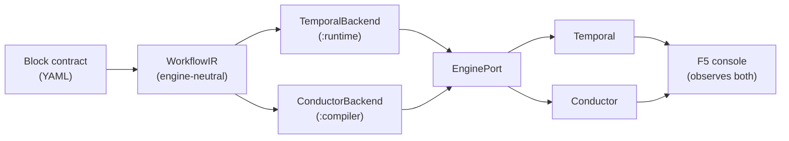

# Koshei

> An **engine-neutral**, contract-driven durable-saga platform for **transactional OT/IT integration**. An engineer declares each step's resilience policy *once* in a YAML **block contract**; the runtime derives idempotency, reverse-order saga compensation, retry, and human-gating from it — and the *same* contract compiles to an engine-neutral IR that runs on **both Temporal and Conductor**, observed in the **same operator console**. A complementary layer to IIoT/DataOps platforms (Ignition, Litmus, ThingWorx, NiFi), **not** a competitor.


*The fail-safe money-shot on **Temporal**: an upstream safety pre-check fails; completed steps roll back in reverse order and the irreversible PLC actuation never fires.*


*The **same contract** on **Conductor**: same reverse-order compensation, same un-fired PLC, recovered by a whole-run retry — one console observes both engines.*

## The problem

> **Why this exists.** Koshei grew out of a real factory data-integration platform the author built on **Node-RED**. Node-RED made flows operator-authorable, but it ran the whole plant's integration on a single event loop, and a partial failure mid-flow left no clean recovery — completed writes weren't unwound and a restart lost in-flight state. Koshei is the durable, contract-driven answer to that gap.

Factory-floor integration repeatedly reads from a source RDBMS, joins/transforms it with OT data, and writes to a target — **transactionally**. Some steps are **irreversible** (writing a recipe to a PLC), and the people composing these flows are **operators, not developers** — they don't, and shouldn't have to, understand compensation or idempotency.

Existing tools each cover only part of this. Visual flow tools — **Node-RED** above all — are operator-friendly and beloved for IoT/integration, but they lack durable execution, saga compensation, idempotency, and crash recovery. IIoT hubs do telemetry context but not cross-step compensation. Durable orchestrators (Temporal, Camunda) do durable execution but aren't operator-authorable and lack OT connectivity. The whitespace is the **empty intersection**: a cross-step compensation saga with reversible DB/file handling, *together with* operator-friendly authoring.

### These pain points are real (not invented)

Framed honestly as industry/community/official-doc evidence — not a market study:

- [Node-RED official docs](https://nodered.org/docs/user-guide/context) — flow context is **in-memory by default and cleared on restart**. → Koshei's durable execution + crash recovery keeps run state across restarts.
- [Steve's Node-RED Guide](https://stevesnoderedguide.com/node-red-event-loop-explained) — Node-RED is **single-threaded**; a CPU-intensive node **blocks the event loop and stalls all flows**, making it "unsuitable for applications that require intensive processing." → Koshei runs steps as durable activities on a workflow engine, not one shared loop.
- [microservices.io (Chris Richardson)](https://microservices.io/patterns/data/saga.html) — sagas need **hand-designed compensating transactions** ("rather than relying on the automatic rollback feature of ACID transactions") and risk **data anomalies from lack of isolation**. → Koshei derives reverse-order compensation from each block contract instead of hand-coding it.
- [Plant Engineering](https://www.plantengineering.com/overcoming-it-ot-convergence-challenges-for-predictive-maintenance-in-process-manufacturing/) — process-manufacturing OT is a **"patchwork quilt of disparate OT systems"** on incompatible/antiquated protocols, where integration is **"time-intensive, expensive and complicated."** → Koshei is the engine-neutral durable bridge that makes that integration transactional.

## The keystone — the declarative block contract

Every block ships a declarative `BlockContract` in a YAML manifest. The engineer declares, **once per block**, its idempotency strategy, its compensation (reversibility + kind), its retry budget, and its human policy. The runtime then **derives all resilience behaviour generically** — there is no per-workflow bespoke orchestration code. Rigor lives in the contract, so operators composing flows never carry it.

The canonical `actuate` manifest declares `reversibility: IRREVERSIBLE`, `human.requireApprovalBefore: true`, `retry.maxAttempts: 1` — so nothing in the operator's workflow says "pause for approval before the PLC"; the contract does, and both engines honour it. See [`docs/architecture.md`](docs/architecture.md) §3 for the full field-to-behaviour mapping.

## The scenario — `ot-recipe-apply`

```
sensorRead (db.read) → recordPlan (db.upsert) → interlockAck (notify.email)
                     → preflight (transform.map) → applyPLC (actuate, IRREVERSIBLE + human gate)
```

- **Happy path** — every step commits; the operator approves at the gate; the PLC fires once.
- **Failure** — an upstream step fails permanently, so the run never reaches `applyPLC`. Completed reversible/mitigatable steps compensate in **reverse-topological** order; **the irreversible PLC actuation never fires**. (Fail-safe GIF, `03-failsafe.gif`.)
- **Operator intervention** — the run parks at the human gate before the irreversible step; the operator approves, rejects, retries, or aborts from the console — on either engine (`05-engine-neutral.gif` shows the Conductor whole-run retry).

Deep walkthrough: [`docs/scenario-ot-actuation-demo.md`](docs/scenario-ot-actuation-demo.md).

## What's proven (+ evidence)

**319 tests green, 0 failures** via `./gradlew build`, across 11 Gradle modules; on top of that, **20 objective gate scripts** (`scripts/run-*-gate.sh`) plus E2E/crash-recovery harnesses prove the live behaviour. Every capability below links the gate/test/GIF that proves it.

| Capability | Proof |
|---|---|
| **Engine-neutral compile → both engines** — one contract compiles to an engine-neutral IR, lowered to Temporal and Conductor (incl. branch-parallel concurrency, reverse-topo compensation). | [`run-compiler-ir-gate.sh`](scripts/run-compiler-ir-gate.sh), [`run-conductor-exec-gate.sh`](scripts/run-conductor-exec-gate.sh), [`run-conductor-concurrency-gate.sh`](scripts/run-conductor-concurrency-gate.sh), [`run-scenario-gate.sh`](scripts/run-scenario-gate.sh) |
| **Saga compensation timeline** (both engines) — completed work unwinds in reverse-topo order, best-effort. | [`run-compensation-timeline-gate.sh`](scripts/run-compensation-timeline-gate.sh), [`run-conductor-comp-timeline-gate.sh`](scripts/run-conductor-comp-timeline-gate.sh) |
| **Crash recovery** — a worker killed mid-`db.upsert` is replayed by Temporal on a fresh worker to a consistent state. | [`run-crash-recovery.sh`](scripts/run-crash-recovery.sh) |
| **Idempotent convergence** — duplicate triggers converge to one row. | [`IdempotencyConvergenceTest.kt`](runtime/src/test/kotlin/koshei/runtime/IdempotencyConvergenceTest.kt) |
| **Authoring UI + operator Compose canvas** — palette projected from the block registry; React Flow canvas. | [`run-authoring-gate.sh`](scripts/run-authoring-gate.sh), [`run-compose-run-gate.sh`](scripts/run-compose-run-gate.sh) |
| **F5 operator console** — run history, per-node lighting, compensation timeline, interventions (retry / abort / approve) — for **both** engines. | [`run-console-gate.sh`](scripts/run-console-gate.sh), [`run-conductor-console-gate.sh`](scripts/run-conductor-console-gate.sh), [`run-conductor-node-states-gate.sh`](scripts/run-conductor-node-states-gate.sh), [`run-conductor-retry-abort-gate.sh`](scripts/run-conductor-retry-abort-gate.sh), [`run-intervention-gate.sh`](scripts/run-intervention-gate.sh) |
| **Demo GIFs via Playwright E2E** — the hero GIFs above are generated by an end-to-end harness. | [`run-e2e.sh`](scripts/run-e2e.sh) |

The 6 block handlers are `db.read`, `transform.map`, `db.upsert`, `notify.email`, `actuate`, and `merge`.

## Architecture at a glance

The React authoring UI projects the block registry into a palette and lets an operator compose a workflow. The `:authoring-api` control plane **compiles** that definition once into an engine-neutral `WorkflowIR`, then a backend lowers the single IR to a concrete engine — Temporal (`:runtime`) or Conductor (`:compiler`). The same F5 console observes runs on both engines through one `EnginePort` seam; durable saga state lives in Postgres.



The 11 Gradle modules (`core`, `sdk`, `registry`, `blocks`, `dispatch`, `runtime`, `conductor-runtime`, `compiler`, `app`, `authoring-api`, `opcua`) plus the React `authoring-ui` have build-enforced one-way dependencies — full module map, IR pipeline, and boundary invariants in [`docs/architecture.md`](docs/architecture.md).

## Build & run / see it yourself

Prerequisites: a JDK (the Gradle toolchain auto-provisions JDK 21 via foojay) and **Docker** (Postgres + Temporal + Conductor via Testcontainers / compose).

```bash
# Unit + integration tests (Testcontainers spins up real Postgres/Temporal/Conductor)
./gradlew build                      # 319 tests green, 0 failures

# Objective gate proof (real processes; needs the compose stack)
docker compose up -d                 # Postgres, Temporal, Conductor + UIs
bash scripts/init-db.sh              # apply schema
bash scripts/run-crash-recovery.sh   # kill worker mid-upsert; expect PASS, exit 0

# Regenerate the demo GIFs from the live app (Playwright E2E)
bash scripts/run-e2e.sh
```

### Quickstart — run it & try the console

Launch the app locally and drive the operator console (each long-running command in its own terminal):

1. **Bring up infra + schema** — `docker compose up -d` (Postgres, Temporal, Conductor + UIs), then `bash scripts/init-db.sh` to apply the schema.
2. **Start the Temporal worker** — `./gradlew :app:run` (the `koshei.app.Worker` entrypoint).
3. **Start the control plane** — `./gradlew :authoring-api:run` (Spring Boot edge on **port 18090**).
4. **Start the UI dev server** — in `authoring-ui/`: `npm install` (first time) then `npm run dev` (Vite on **port 5173**, proxies `/api` → 18090).
5. **Open** http://localhost:5173 — use the **Compose** tab to drag blocks into a workflow, then the **Console** tab to run it and watch per-node lighting, reverse-order compensation, and operator interventions (approve / reject / retry / abort) live.

> Honest note: this is a **single-process local demo** (one worker, the compose stack on one host), not a scaled or production deployment.

**Want to author your own block, operate the console, or configure it?** See the [**Using & Extending Koshei**](docs/usage.md) developer guide — it walks authoring a custom block (scaffold → implement → publish → palette → compose → run) plus operating and configuration.

## Honest scope & trajectory

This project keeps an explicit ledger of what is grounded vs. hypothesis:

- **Technical durability axis — grounded.** The hard core — durable saga, idempotency, and reverse-topo compensation — is proven on **real processes across both engines** (Temporal + Conductor), with a full operator console over both; **crash-recovery/replay is proven on Temporal** (the load-bearing durable engine). (See [`docs/architecture.md`](docs/architecture.md) §8–§9.)
- **Product / UX / demand axis — hypothesis.** That non-developers *will and can* safely author transactional sagas, and that there is buy-intent, are **not** validated; commercialization is deliberately deferred. This is an engineering artifact, not a market-proven product.

**Done (v0.1 → v0.6 + engine-neutral demo):** contract-driven Temporal saga · compiler/IR · Conductor execution · DAG/concurrency · authoring + compose canvas · F5 console with interventions, per-node lighting, and compensation timeline on **both** engines · scenario value-demo + hero GIFs.

**Remaining candidates:** real OT connectors (PLC/OPC/MQTT) · run-state persistence beyond the compensation ledger · continuous CI for the gate scripts · usability validation with real operators.

## Docs

- [`docs/usage.md`](docs/usage.md) — **Using & Extending Koshei**: run it, author your own block, operate the console, configure.
- [`docs/architecture.md`](docs/architecture.md) — the as-built engineering deep-dive (keystone mapping, IR pipeline, module graph, verification, honest limits).
- [`docs/reference-architecture.md`](docs/reference-architecture.md) — the portfolio picture: how koshei composes with the edge-governance and twin/analytics projects into one governance loop.
- [`docs/scenario-ot-actuation-demo.md`](docs/scenario-ot-actuation-demo.md) — deep walkthrough of the `ot-recipe-apply` scenario.

## License

**PolyForm Noncommercial License 1.0.0** — see [`LICENSE.md`](LICENSE.md). Noncommercial use is freely permitted; commercial use is reserved. This is a *source-available* license — it does **not** meet the OSI Open Source Definition; "OSS" here means publicly available and contributable.

Copyright © 2026 LivingLikeKrillin (livinglikekrillin@gmail.com).
