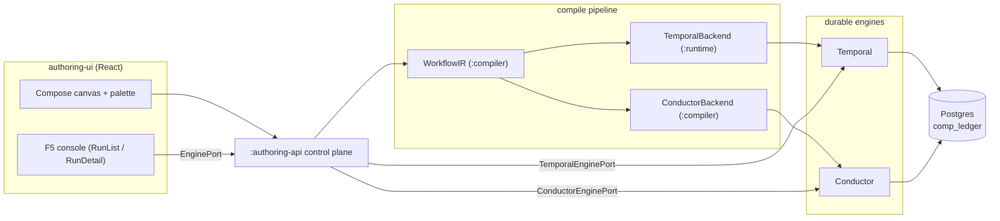
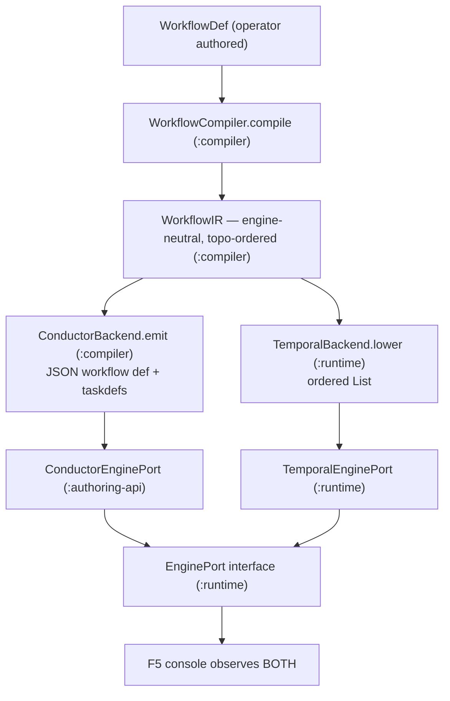
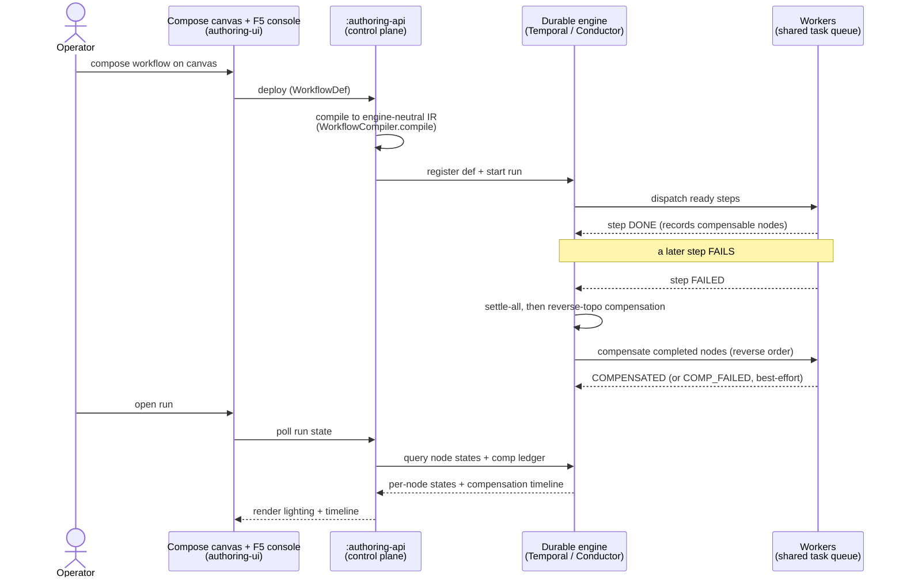
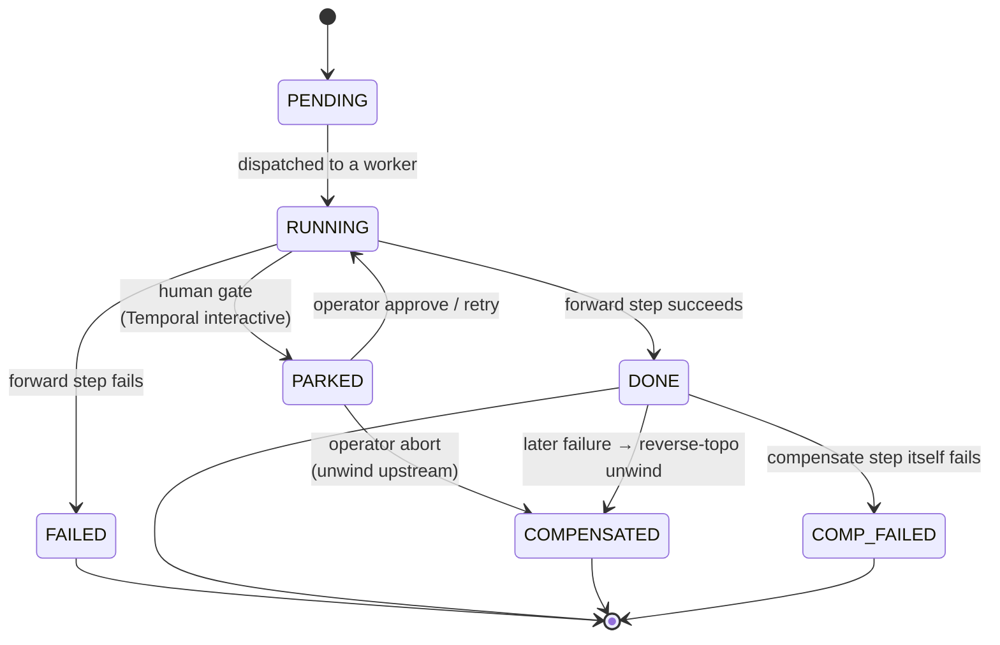
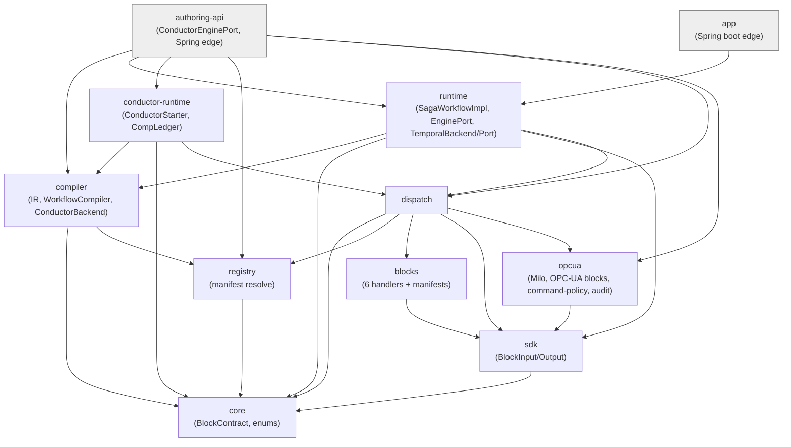
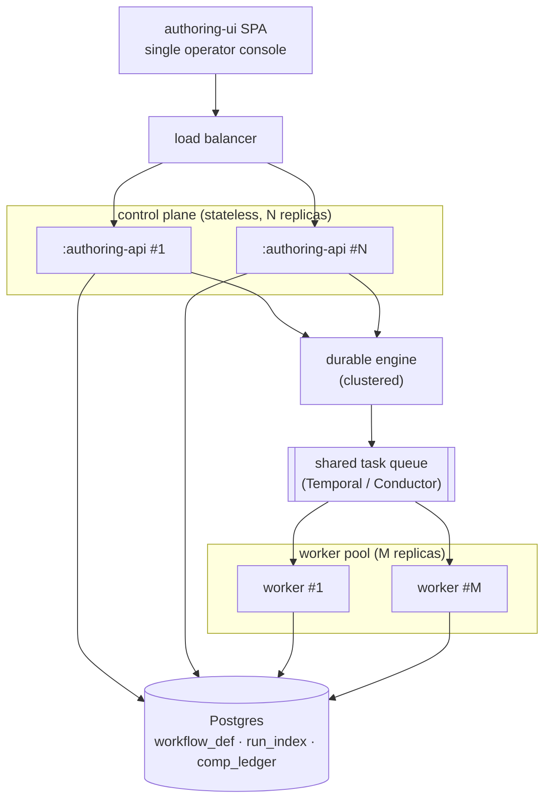

# Koshei — Architecture (as-built)

## 1. Purpose and the hard problem

Koshei composes and runs **durable sagas** for transactional OT/IT integration — multi-step
workflows where the final step is often an **irreversible side-effect** (e.g. writing a recipe to
a PLC) and where the people composing the flow are **operators, not developers**. The hard part is
not "run a DAG". It is that a durable saga must, *for every step a non-developer drags onto a
canvas*, guarantee the right thing automatically: idempotent re-execution after a crash,
compensation of already-committed work in the correct order when a later step fails, a **human
approval gate parked in front of anything irreversible**, and bounded retry — all without the
author writing a single line of orchestration code, and all surviving a worker crash. This document
describes how the codebase makes those guarantees real, and is honest about where the guarantees
currently stop (§10).

## 2. System overview

The authoring UI (a React app) projects the block registry into a palette and lets an operator
compose a workflow on a canvas. That definition is sent to the `:authoring-api` control plane, which
**compiles** it to an engine-neutral IR and then lowers it to a concrete engine — Temporal (via
`TemporalBackend` in `:runtime`) or Conductor (via `ConductorBackend` in `:compiler`). Workers
execute the block handlers; durable state lives in Postgres. The same F5 operator console observes
runs on **both** engines through one `EnginePort` seam.

## 3. The keystone — block contract drives derived resilience

Every block ships a declarative `BlockContract`
(`core/src/main/kotlin/koshei/core/Contract.kt`) loaded from a YAML manifest. The runtime derives
*all* resilience behaviour from those fields generically — there is **no per-workflow bespoke
orchestration code**. The mapping is:

| Contract field | Enum / shape | Derived behaviour | Where consumed |
| --- | --- | --- | --- |
| `idempotency` | `IdempotencyStrategy{NONE,KEY_DEDUP,UPSERT,NATURAL}` + `keyExpression` | dedup of input rows before the forward call | `SagaWorkflowImpl.run` (KEY_DEDUP branch) |
| `compensation` | `Reversibility{REVERSIBLE,MITIGATABLE,IRREVERSIBLE}` + `CompensationKind{STATIC,CONTEXTUAL,NONE}` | which completed nodes are eligible for compensation | `SagaWorkflowImpl` / `CompensationOrder` |
| `retry` | `RetrySpec(maxAttempts, initialMs, maxMs)` | Temporal `RetryOptions`; Conductor `retryCount` | `SagaWorkflowImpl`, `ConductorBackend.emitTaskDefs` |
| `human` | `HumanSpec(requireApprovalBefore)` | park before the step for operator approve/reject | `SagaWorkflowImpl` gate; Conductor `WAIT` task |
| `compensation.reversibility == IRREVERSIBLE` | — | also forces a human gate (cannot undo, so confirm first) | `SagaWorkflowImpl`; `ConductorBackend.needsWait` |

The real `actuate` manifest (`blocks/src/main/resources/manifests/actuate.yaml`) is the canonical
example: `compensation.reversibility: IRREVERSIBLE`, `kind: NONE`, `human.requireApprovalBefore:
true`, `retry.maxAttempts: 1`, `sideEffects: [ACTUATION]`. Nothing in the author's workflow says
"pause for approval" — the contract does, and both engines honour it: Temporal via the
`Workflow.await { approved || rejected || aborted }` gate, and Conductor by compiling that node into
a `WAIT` task (`ConductorBackend.needsWait` → `taskFor`, type `WAIT`, 24h taskdef timeout).

## 4. Engine neutrality — compile once, run on two engines (the headline)

The control plane compiles an operator's workflow **once** into an engine-neutral `WorkflowIR`
(`compiler/src/main/kotlin/koshei/compiler/Ir.kt`, produced by `WorkflowCompiler.compile`), then a
backend lowers that single IR to a concrete engine. The contract is the carrier: each `IrNode`
holds the resolved, version-pinned `BlockContract`, so both backends read the same resilience facts.

The module placement is **deliberately asymmetric, and this doc depicts it as-built rather than
tidying it into false symmetry**:

- The IR and `WorkflowCompiler` live in **`:compiler`**.
- `ConductorBackend` lives in **`:compiler`** — it is pure data (Jackson only, no Conductor
  runtime), emitting a Conductor workflow-definition JSON. It even self-validates by round-tripping
  the output (`ConductorBackend.validate`), so the server is not required to compile.
- `TemporalBackend` lives in **`:runtime`** (not `:compiler`), because "lowering to Temporal" is
  trivial — the saga is already contract-driven, so it just projects the IR's per-node contracts in
  order (`TemporalBackend.lower` = `ir.nodes.map { it.contract }`).
- The `EnginePort` interface lives in **`:runtime`**. `TemporalEnginePort` is in **`:runtime`**;
  `ConductorEnginePort` is in the **`:authoring-api`** edge — so that `:conductor-runtime` itself
  never depends on Temporal or on `koshei.runtime`.

**Boundary invariants** (verified, see §8): `:conductor-runtime/src/main` contains **0**
`io.temporal` imports and **0** `koshei.runtime` imports; `:core / :registry / :compiler /
:dispatch` main contain **0** `org.springframework` imports (Spring is confined to the
`:authoring-api` / `:app` edges).

**Honest engineering note (R-1).** Conductor abort does *not* rely on the engine's own
failureWorkflow dispatch. On conductor-standalone 3.15.0, `terminateWorkflowWithFailure(id, reason,
triggerFailureWorkflow=true)` terminates the run but does **not** dispatch the registered
failureWorkflow, leaving the `comp_ledger` un-compensated. So `ConductorStarter.abortWithCompensation`
**self-dispatches** the `<name>-compensation` workflow with the `{workflowId: <id>}` input Conductor
would have injected on a natural failure — its compensate tasks then read the forward run's ledger
entries and unwind them. This is documented in code and proven by `run-conductor-retry-abort-gate.sh`.

## 5. Durable saga execution

`SagaWorkflowImpl` (`runtime/.../SagaWorkflowImpl.kt`) is the contract-driven Temporal saga:

- **Promise-graph concurrency.** It builds a `Promise<BlockOutput>` per node over the topo-ordered
  IR; each node awaits its upstream promises, so independent branches run concurrently.
- **Settle-all, never fail-fast.** On failure it settles every branch first (`Promise.handle` +
  `Promise.allOf`, the sdk-java #902 non-determinism mitigation) before compensating — so partial
  parallel failure is handled deterministically.
- **Reverse-topological compensation.** As nodes complete, `SagaWorkflowImpl` records the compensable
  ones (the eligibility predicate `reversibility != IRREVERSIBLE && kind != NONE`); on failure,
  `CompensationOrder.reverseTopological` walks the topo list in reverse over that completed-and-compensable
  set to produce the unwind order. Compensation is **best-effort**: a failing compensate step records
  `COMP_FAILED` and continues unwinding the rest.
- **Human gate before irreversible.** The gate is evaluated once, outside the retry loop; an abort
  or reject there is terminal and propagates into settle-all → compensate.
- **Crash recovery.** `scripts/run-crash-recovery.sh` kills the worker mid-flight; Temporal replays
  the in-flight activity on restart and the run completes.
- **Conductor saga state.** Conductor's failureWorkflow cannot carry in-memory saga state, so
  `CompLedger` (`conductor-runtime/.../CompLedger.kt`) externalizes it in Postgres, keyed by
  **PK `(workflow_id, node_id)`** — exactly one row per compensable node per run, so parallel
  branches sharing a `blockId` never collide. The compensation timeline is read back from this
  ledger ordered by reverse-topo `idx`.

The canonical scenario `ot-recipe-apply`
(`scripts/fixtures/compose/ot-recipe-apply.json`) exercises this end to end:
`sensorRead`(db.read) → `recordPlan`(db.upsert) → `interlockAck`(notify.email) →
`preflight`(transform.map) → `applyPLC`(actuate, IRREVERSIBLE + gate).

The **run lifecycle** — from the operator's compose action through compile, deploy, start, execute,
a step failure, reverse-topo compensation, and back to what the F5 console observes — is the
behavioural spine of the system:

*When a step fails, completed reversible work unwinds in reverse-topological order and the IRREVERSIBLE PLC actuation never fires — safe by contract.*

## 6. Operator surfaces

- **Authoring UI palette** is a projection of the block registry — operators see exactly the
  registered, version-pinned blocks; manifest `label`/`help`/`widget` fields drive the field UI.
- **Compose canvas** is built on React Flow (the library supplies graph *mechanics*; the visual
  design is the project's own design system, not the library's defaults).
- **F5 console** (`authoring-ui/src/views/console/{ConsoleView,RunList,RunDetail}.tsx`) shows run
  history, per-node lighting, the compensation timeline, and interventions
  (approve / reject / retry / abort). It is **engine-tagged for both engines**: `RunList` shows an
  engine chip, and `RunDetail` branches the retry affordance — Conductor offers a **whole-run**
  retry ("재시도(전체)"), Temporal offers **per-node** retry of a parked node — because Conductor has
  no parked-node primitive. Both Conductor retry and abort are **implemented**, not stubbed
  (`ConductorEnginePort.signalRetry/signalAbort`).

The lighting the console renders is driven by a small, fixed **per-node state set** — the
`NodeState` union in `authoring-ui/src/types.ts` (`PENDING | RUNNING | DONE | FAILED | COMPENSATED |
PARKED | COMP_FAILED`), surfaced as the `ns-*` CSS classes in
`authoring-ui/src/views/compose/BlockNode.tsx` and derived engine-side by
`ConductorNodeStates.kt` for Conductor. The node lifecycle is:

`PARKED` exists only on the Temporal interactive path (Conductor has no parked-node primitive, so
its mapper in `ConductorNodeStates.kt` never emits it); a parked node resumes to `RUNNING` on
approve/retry or unwinds via compensation on abort. `COMPENSATED` vs `COMP_FAILED` records whether a
node's compensate step succeeded — compensation is best-effort, so a failed compensate is recorded
and the rest of the unwind continues (§5).

## 7. Module map and dependency graph

Eleven Gradle modules (from `settings.gradle.kts`; `authoring-ui` is the React app, not a Gradle
module). Edges point in the direction of the dependency (A → B means A depends on B).

**Boundary rules baked into this graph:** `:conductor-runtime` depends on `:compiler`/`:core` but
**not** on `:runtime` or `io.temporal`; Spring lives only in the `:authoring-api` / `:app` edges, so
`:core / :registry / :compiler / :dispatch` stay framework-free. `ConductorEnginePort` is hoisted up
into `:authoring-api` precisely to keep `:conductor-runtime` clean of the `EnginePort` (Temporal)
seam.

## 8. Verification strategy

**319 tests green, 0 failures** across the 11 product modules via `./gradlew build` (registry 67 ·
authoring-api 48 · compiler 47 · opcua 44 · runtime 37 · conductor-runtime 33 · blocks 17 · core 17 ·
dispatch 5 · sdk 4 · app 0). The disposable de-risking spike is excluded from that figure. Engine-touching
tests use **Testcontainers** (real Postgres / Temporal / Conductor), development is TDD, and there
are **20 objective gate scripts** (`scripts/run-*-gate.sh`) plus a Playwright E2E → GIF harness
(`scripts/run-e2e.sh`, specs in `authoring-ui/e2e/`) and a crash-recovery harness
(`scripts/run-crash-recovery.sh`).

Headline capability → the artifact that proves it:

| Capability | Proving artifact |
| --- | --- |
| Compile to engine-neutral IR | `run-compiler-ir-gate.sh` |
| DAG wiring + topo order | `run-dag-gate.sh` |
| Temporal concurrency (promise graph) | `run-concurrency-gate.sh` |
| Conductor concurrency (FORK_JOIN/JOIN) | `run-conductor-concurrency-gate.sh` |
| Per-node states / canvas lighting | `run-node-states-gate.sh`, `run-conductor-node-states-gate.sh` |
| Compensation timeline (both engines) | `run-compensation-timeline-gate.sh`, `run-conductor-comp-timeline-gate.sh` |
| Human gate + interventions | `run-intervention-gate.sh` |
| Conductor retry/abort + R-1 self-dispatch | `run-conductor-retry-abort-gate.sh` |
| Conductor end-to-end execution | `run-conductor-exec-gate.sh` |
| Console (both engines) | `run-console-gate.sh`, `run-conductor-console-gate.sh` |
| Add-a-block / authoring / compose-run | `run-add-block-gate.sh`, `run-authoring-gate.sh`, `run-compose-run-gate.sh` |
| Full OT scenario | `run-scenario-gate.sh` |
| Crash recovery (Temporal) | `run-crash-recovery.sh` |

## 9. Scale-out & deployment topology

The question this section answers: *"Can the backend scale out under load while the frontend stays a
single portal?"* — **Yes, by design** (with the honest as-built caveat at the end).

- **Backend scales horizontally.** Workers **poll a shared task queue**, so throughput grows by
  adding worker replicas with no code change. On Temporal, `app/.../Worker.kt` starts a
  `WorkerFactory` worker that polls the shared `koshei-v0_1-tq` task queue (`factory.start()`); on
  Conductor, `conductor-runtime/.../ConductorWorkerMain.kt` boots one `ForwardWorker` per builtin
  blockId (task type = blockId) plus a `CompensateWorker`, all polling Conductor via
  `TaskRunnerConfigurer`. More replicas → more pollers competing for the same queue → more
  throughput. The `:authoring-api` control plane is a **thin, mostly-stateless edge**: the durable
  state lives in Postgres (`workflow_def`, `run_index`, `comp_ledger`) and in the engine, so the
  control plane can run multi-replica behind a load balancer (its only per-process state is an
  idempotent deploy-dedupe cache, which is safe to lose). The durable engines themselves
  (Temporal / Conductor) are clustered, horizontally-scalable systems.
- **Frontend stays a single portal.** The React `authoring-ui` is a **static SPA — one operator
  console**; load never scales the frontend. Operators control and observe through **one window
  regardless of how many workers run**: scale is transparent (the operator does not know the worker
  count). This is a stated design principle, not an accident of the demo.
- **Evidence.** The de-risking spike proved **shared-task-queue scale-out + failover** as proof
  **P5**: `run-p5-scaleout.sh` killed worker 1 and a fresh
  workflow **completed on the surviving worker 2** (failover), with activity distribution observed
  across both workers (`w1=18 w2=27` forward markers). The spike's engine verdict (OQ1) records it
  plainly: *"Shared task queue gives scale-out + failover (P5)."*

**HONEST LIMIT (load-bearing — not overstated).** The as-built repo is a **single-process local
demo**: one worker, one `:authoring-api`, a docker-compose stack. Horizontal scale-out is
**designed-for, not deployed** — the seams make it possible (poll-based workers on a shared queue, a
stateless externalized-state control plane, clustered engines) and the engine's task-queue scaling
is spike-proven (P5 above) — but a **multi-replica Kubernetes / HPA / Helm deployment is NOT built**;
it is roadmap (design-doc ADR-11), and the architecture is deliberately kept non-breaking toward it.
See the broader honesty inventory in §10.

## 10. Honest limits and non-goals (current)

- **Crash-recovery is demonstrated on Temporal only** (`run-crash-recovery.sh`); the Conductor path
  is not exercised by an equivalent kill-and-replay harness.
- **Conductor node-state overlay is eventually consistent** — conductor-standalone indexes
  asynchronously, so the COMPENSATED overlay surfaces after a short grace-poll window
  (`RunDetail.tsx` TERMINAL_GRACE), not instantly.
- **No real OT connectors yet** — the `actuate` block is a modelled IRREVERSIBLE side-effect, not a
  live PLC driver.
- **Single-version Conductor definitions** — a Conductor def is keyed by bare `name`, not
  `name@version` like Temporal; multi-version Conductor is future work
  (`ConductorEnginePort` limitation note).
- **E2E/GIFs run locally / on-demand**, not in continuous CI.
- The **product / demand axis is unvalidated** — this is an engineering artifact, not a
  market-proven product.

## 11. Design rationale and decision record

- `docs/scenario-ot-actuation-demo.md` — the deep walkthrough of the `ot-recipe-apply` scenario.
- `docs/usage.md` — the **Using & Extending Koshei** developer guide: run it, author your own block (the SDK + `:app:cli` scaffold/publish flow), operate, and configure.
