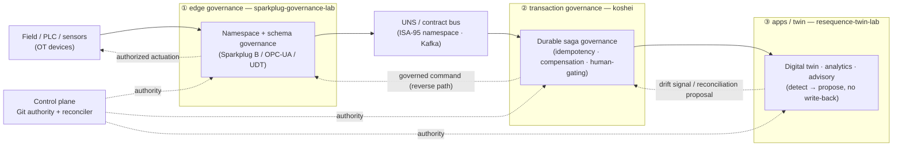
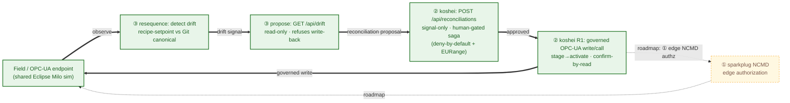
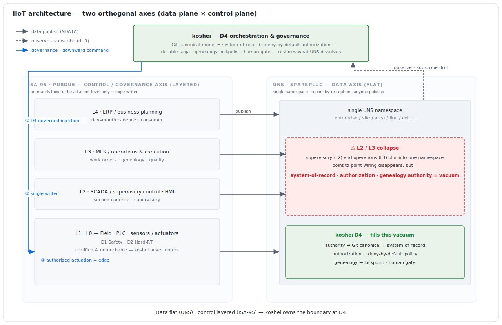

# A Composable OT/IT Manufacturing-DX Reference Architecture

> **Standardize the edge · Govern the transaction · Compose the value.**

> **Honest banner.** This is an engineering portfolio of proof-of-concepts running on
> synthetic / demo topologies — not a shipped commercial product. Every capability stated
> here is backed by a concrete artifact in one of the three repositories, or is explicitly
> marked as roadmap.

## 0. TL;DR

This document is a **vendor-neutral, governance-first reference architecture for OT/IT
integration**, realized by **three independent, composable open projects** rather than a single
monolithic tool. Each project was built on its own, yet they line up as three layers of one
coherent picture:

- **① `sparkplug-governance-lab`** — *standardize the edge*: edge / namespace governance.
- **② `koshei`** (this repository) — *govern the transaction*: durable transaction / saga
  governance and governed command origination.
- **③ `resequence-twin-lab`** — *compose the value*: the application / digital-twin / analytics
  consumer.

The theme is **"Standardize the edge · Govern the transaction · Compose the value."** — one
clause per project.

**Thesis (one sentence):** three projects, each owning a single bounded responsibility behind
standards-only interfaces, **compose into one closed governance loop** while having
**independently converged on the same engineering disciplines** — and that convergence is the
evidence the architecture is real, not retrofitted.

For the one-screen picture of how the layers connect — the tiers, the control plane, and the
reverse command path — see the at-a-glance diagram in [§2](#2-the-architecture-at-a-glance).

## 1. The problem & the whitespace

Factory OT/IT integration keeps asking one tool to do three jobs at once, and the tool keeps
breaking under the load. Look at almost any plant-floor integration and the same three
responsibilities are tangled together:

1. **Ingesting unstandardized edge data.** Sensors, PLCs, and historians speak incompatible
   protocols with ad-hoc, undocumented tag names; the integrator hand-maps each one and the
   "namespace" drifts the moment a device is added. Process-manufacturing OT is, in the words
   of [Plant Engineering](https://www.plantengineering.com/overcoming-it-ot-convergence-challenges-for-predictive-maintenance-in-process-manufacturing/),
   a *"patchwork quilt of disparate OT systems"* on incompatible protocols, where integration
   is *"time-intensive, expensive and complicated."*
2. **Tying heterogeneous systems together transactionally.** A flow reads a source system,
   joins it with OT context, and writes to a target — and some of those writes are
   **irreversible** (pushing a recipe to a PLC). This is a distributed-transaction problem:
   sagas need [hand-designed compensating transactions](https://microservices.io/patterns/data/saga.html)
   rather than ACID rollback, and they risk data anomalies without isolation. Yet this
   transactional job is routinely pushed down onto the SCADA / visual-flow layer, which has no
   durable execution, no compensation, no idempotency, and loses in-flight state on restart.
3. **Bolting on apps, analytics, and twins.** Dashboards, optimizers, and digital twins are
   wired directly into the same brittle plumbing, so a change at the edge ripples into the
   analytics layer and back, and nothing can be reasoned about or replaced in isolation.

These are **three distinct responsibilities**. The failure mode is **cramming all three into a
single tool** — a visual-flow runtime, a historian, or an orchestrator — and discovering that a
tool built for one of them is structurally unfit for the other two. The whitespace is not a
missing feature; it is a **missing separation**: split the three responsibilities behind clean,
**standards-only interfaces** so that each can be **independently governed, independently
proven, and independently replaced**.

That separation is exactly what the three projects do. The three responsibilities map directly
onto the three movements of this architecture — *standardize the edge*, *govern the
transaction*, *compose the value* — developed in [§3](#3-three-movements). The next section
shows how they connect.

## 2. The architecture at a glance

Data flows left to right along a **forward path** — the field is standardized at the edge,
published onto a contract-governed bus, consumed by apps that detect when reality has drifted
from intent — and corrections flow back along a **reverse (command) path**, where the
transaction-governance core drives the field back to its declared canonical. A **control plane**
(Git as the source of authority, plus a reconciler) sits across every tier rather than inside
any one of them.

**How to read it — each tier maps to one project and one clause of the theme:**

| Tier | Project (pillar) | Theme clause |
|---|---|---|
| Edge governance (field → UNS/contract bus) | ① `sparkplug-governance-lab` | **Standardize** the edge |
| Transaction governance (the durable, human-gated saga; the reverse command path) | ② `koshei` | **Govern** the transaction |
| Apps / twin / analytics (the consumer that detects drift and proposes, never writes back) | ③ `resequence-twin-lab` | **Compose** the value |

The solid arrows are the forward (telemetry) path; the dashed arrows are the reverse (command)
path that closes the loop — apps emit a drift signal, the transaction core executes a governed
correction, and the edge authorizes the actuation back to the field. This is the **design-intent**
topology; what is actually built today versus what is roadmap is made explicit in
[Diagram 2](#diagram-2--the-loop-as-a-cycle-built-vs-roadmap) (§4). The deeper layer model
behind this picture — the D1–D4 realtime/safety domains crossed with the ISA-95 L0–L4 levels,
and exactly where each component sits — is summarized later in [§6.1](#61-domain--layer-model).

## 3. Three movements

The architecture is three movements, one per project. Each project is its own repository,
its own build, and its own bounded responsibility; each refuses to do the other two's jobs.
What follows is the role each plays and the concrete assets that back it. None of the three
depends on the internals of another — they meet only at standards-only interfaces (Sparkplug B
/ OPC-UA / UNS topics, a UNS bus, plain HTTP signals, and Git as shared authority).

### 3.1 Standardize the edge — ① `sparkplug-governance-lab`

**Role: own the *nouns* at the edge.** This project answers the first responsibility from
[§1](#1-the-problem--the-whitespace) — taking unstandardized, drift-prone edge data and giving
it a governed, versioned, machine-checkable shape *before* it ever reaches the bus. It is a
Java project (Eclipse Tahu + Eclipse Paho + HiveMQ CE, Apache-2.0) with 142 pure-logic tests,
organized so the edge namespace is something you can *govern with a gate*, not just document.

The governance assets, by module:

- **`schema`** — a UDT data-contract registry with a **fail-closed, pre-deploy compatibility
  gate** (`SchemaGate`): SemVer-versioned contracts checked under `FORWARD` / `BACKWARD` /
  `FULL` / `NONE` compatibility modes, so an incompatible model change is rejected *before*
  deployment rather than discovered at runtime.
- **`opcua`** — maps an OPC-UA information model into Sparkplug UDTs via Eclipse Milo browse,
  with an **explicit loss ledger** that records exactly what does not survive the mapping
  (rather than silently dropping it).
- **`kafka`** — a stateful UNS→Kafka bridge where report-by-exception is reconciled with
  log-compaction semantics, with a dead-letter queue for messages that cannot be placed.
- **`acl`** — NCMD command authorization built **deny-by-default**: a single policy projects
  into an edge authorizer, a broker ACL, and a CI lint gate, so the same authorization intent
  is enforced in three places and checked in CI.
- **`drift`** — runtime schema-drift detection (detect-only): it watches for the live edge
  diverging from the declared contract.
- **`spb40`** — a **prototype exploring concepts from the (as-yet unreleased) Sparkplug 4.0**
  direction. This is an experiment, **not** an implementation of a ratified specification, and
  should be read as such.

The one-line idea that ties the modules together: *the pre-deploy gate (`schema`/`SchemaGate`)
opens a governance loop that runtime drift detection (`drift`) closes.* On top of the code sit
11 bilingual ADRs and a namespace standard that maps ISA-95 onto a concrete topic hierarchy.

- Repository: <https://github.com/LivingLikeKrillin/sparkplug-governance-lab>
- Namespace standard (ISA-95 → topic):
  <https://github.com/LivingLikeKrillin/sparkplug-governance-lab/blob/main/docs/namespace-standard.en.md>

### 3.2 Govern the transaction — ② `koshei`

**Role: own the *verbs* — the durable transaction.** This project (this repository) answers
the second responsibility from [§1](#1-the-problem--the-whitespace): tying heterogeneous
systems together transactionally, including writes that are **irreversible** in the field. It
is the D4 durable saga-governance core, and it is also the **only** pillar permitted to
*originate a governed command* back toward the field.

What it governs are the verbs of a distributed transaction — **idempotency**, **reverse-order
compensation**, **retry**, and **human-gating** — and the defining choice is that none of these
are hand-coded per workflow. They are **derived from a per-block contract kept in Git**, so a
non-developer composing blocks gets safe-by-construction execution. The core is **engine-neutral**:
one intermediate representation compiles onto two execution engines (Temporal and Conductor),
and both are observed in a single F5 console — the governance semantics are the koshei
contract's, not any one engine's.

The **R1** capability makes the reverse path concrete: a *governed* OPC-UA write/call with a
**two-phase stage→activate** shape, **deny-by-default** command policy, **EURange** validation,
**confirm-by-read** after the write, and a **persisted command audit**. That is what lets koshei
be trusted to drive a real field endpoint.

For the role in the larger picture, the as-built internals, and the full module map (rather than
a module count restated here), see:

- [`README.md`](../README.md) — what koshei is and the value-first overview
- [`docs/architecture.md`](architecture.md) — the as-built architecture, incl. the
  [module map and dependency graph](architecture.md#7-module-map-and-dependency-graph)

### 3.3 Compose the value — ③ `resequence-twin-lab`

**Role: own the application — compose the value, and *refuse to write back*.** This project
answers the third responsibility from [§1](#1-the-problem--the-whitespace): the apps, analytics,
and digital twin that turn governed data into decisions — built as a *consumer* that sits cleanly
on top of the loop rather than tangled into the plumbing. It is a synthetic-data
Painted-Body-Store (PBS) resequencing proof-of-concept (Kotlin/Spring on `:8081` plus Python)
that compares a multi-objective dynamic sequencing policy against a static baseline, reporting
**relative-delta KPIs only**, guarded by multi-seed **hard invariants** and fix-toggle causality
checks. An offline CP-SAT optimality-gap oracle is used for **measurement only** — it is not the
runtime policy.

The pipeline is standards-composed end to end: SimPy → Kafka → an Eclipse Ditto digital twin →
a read-only advisory REST surface and an MCP/RAG advisory agent (FastMCP with Claude as host and
a local BM25 RAG), visualized via OpenUSD/Grafana. Its OPC-UA adapters use Eclipse Milo and are
**read-only** (`SecurityPolicy.None` / anonymous, PoC posture).

The governance-relevant part is the **DriftMonitor**, which detects two kinds of drift —
structural (configuration) drift and behavioral drift via an EWMA-residual signal — and surfaces
them on an advisory `GET /api/drift` endpoint carrying a `ReconciliationProposal`. The crucial
discipline: this project is strictly **detect → propose → human-approve, with NO write-back**.
It will tell you reality has drifted from intent and propose what to do, but it will never drive
the field itself. That refusal is deliberate — driving the field is ②'s job — and it is what
makes the closed loop in [§4](#4-the-organic-loop--composition-proven) safe.

- Repository: <https://github.com/LivingLikeKrillin/resequence-twin-lab>

## 4. The organic loop — composition, proven

The three movements are not just adjacent; they **close a loop**. This section gives the loop
three ways: first the full design intent, then the part that is actually built and proven, then
an honest statement of the gap between them.

### 4.1 The full loop (design intent)

End to end, the architecture is meant to run as a single closed cycle:

1. The **field** is standardized at the edge by **① `sparkplug-governance-lab`** — namespace and
   schema governance turn raw device data into governed, versioned UDTs.
2. Governed data is published onto the **UNS / Kafka** contract bus.
3. **③ `resequence-twin-lab`** consumes it, maintains a twin, and **detects when reality has
   drifted from intent**. It emits a **read-only reconciliation proposal** — and *refuses to
   write back*.
4. **② `koshei`** picks up that proposal and **executes it as a durable, human-gated,
   compensating saga**, driving the field back to the **Git canonical** — the very write-back
   that ③ declined to perform.
5. The corrected command flows back toward the field through **① NCMD authorization** at the
   edge, actuates, and the cycle returns to **observe**.

The load-bearing property is **mutual refusal**: ③ detects but will not actuate; ② actuates but
only under its own contract, human-gate, and deny-by-default policy, and does not pretend to
own the edge namespace; ① standardizes and authorizes commands but does not run the transaction.
**Each pillar refuses to do the others' jobs, and that refusal *is* the architecture** — it is
what keeps each piece independently governable, provable, and replaceable, exactly the
separation argued for in [§1](#1-the-problem--the-whitespace).

### 4.2 The built proof (honest)

Most of that loop is already built and proven, end to end, as a **merged two-pillar integration
PoV** between ② and ③ — drift-triggered governed reconciliation on a **shared Eclipse Milo
OPC-UA sim** and live Temporal:

- ③ resequence detects **recipe-setpoint drift** (observed setpoint vs koshei's Git canonical
  `model/recipe-setpoints.yaml`) and surfaces it on the read-only `GET /api/drift`.
- The proposal is relayed to ② koshei's inbound `POST /api/reconciliations` as a **signal only**
  — it carries *which* logical nodes drifted, **never a value**. Koshei looks up and validates
  the desired value from its **own** Git canonical and deny-by-default policy (EURange-checked),
  so an external system can *prompt* a reconciliation but can never *inject* a setpoint.
- Koshei starts its **human-gated `ot-recipe-stage-activate` saga**; on approval the **R1
  OPC-UA write** (stage→activate, confirm-by-read) drives the field back to canonical, the twin
  re-reads, and **drift is cleared**.

The integration gate proves three things objectively:

- **T1 — loop closure:** drift → reconcile → approve → field back to canonical → drift cleared,
  with the command audit **WRITTEN** and **CONFIRMED**.
- **T2 — human veto:** on reject, R1's compensation **RESTORES** the staged value
  (`opcua.write RESTORED`) — the field is *not* changed and **drift persists**, proving the
  human gate actually blocks the field change.
- **T3 — trust boundary:** a signal naming an ungoverned / non-policy node is rejected with
  **HTTP 400** — no run starts and no write occurs.

Sources for this slice:

- Gate: [`scripts/run-integration-pov-gate.sh`](../scripts/run-integration-pov-gate.sh)

### 4.3 Honest gap (built vs designed)

One segment of the full loop is **roadmap, not built**: pillar-①/Sparkplug **NCMD edge
authorization** is not yet wired into the running loop — the built PoV closes between ② and ③ on
a shared OPC-UA sim, without ① in the command path. That gap does **not** leave the built loop
unauthorized, however: koshei **R1 already enforces its own deny-by-default command policy +
EURange validation** on every governed write, so authorization is enforced *inside* the
two-pillar loop today. The roadmap item is to additionally enforce authorization at the edge via
① NCMD, making the loop authorized in two independent places (mirroring ①'s own
authorizer/broker-ACL/CI projection). Until then: **the two-pillar loop is built and proven; the
①-NCMD edge-authorization segment is designed.**

### Diagram 2 — the loop as a cycle (built vs roadmap)

**Caption.** Solid (green) edges and nodes are the **built** two-pillar slice proven by the
integration PoV; the thick cycle
**observe → drift signal → reconciliation proposal → approved → governed write → observe** is
exactly the loop closed by `run-integration-pov-gate.sh` (T1, with T2 human-veto and T3
trust-boundary). The dashed (amber) segment through **① sparkplug NCMD edge authorization** is
**roadmap**: not in the built loop today — though authorization is still enforced inside the
built loop by koshei R1's own deny-by-default policy + EURange validation. The roadmap framing
(including the ①-NCMD segment) and the cross-project convergence evidence are developed in the
sections that follow.

## 5. Why they cohere — shared disciplines

The loop in [§4](#4-the-organic-loop--composition-proven) shows the three projects *fit*. This
section argues something stronger: they cohere because they independently arrived at the **same
engineering disciplines**. The three repos were built separately, on different stacks, for
different jobs — there was no shared framework, no common base class, no coordination layer to
force agreement. Yet line up their governance primitives side by side and the same handful of
ideas recurs in all three. That is not the signature of three projects designed to match; it is
the signature of three honest attempts at OT/IT governance **hitting the same truths
independently** — and convergence-without-coordination is far better evidence that the
architecture is real than any amount of after-the-fact narrative could be.

The matrix below maps each shared primitive against the three pillars. A **✓** cites the concrete
artifact that embodies it; a **—** marks where the primitive is genuinely **not applicable** to
that pillar. The "—" cell is deliberate and load-bearing: a matrix that was ✓ everywhere would
mean the rows were chosen to flatter, not to test. The honest gap is what makes the ✓'s
trustworthy.

| Shared primitive | ① `sparkplug-governance-lab` | ② `koshei` | ③ `resequence-twin-lab` |
|---|---|---|---|
| **Git / declarative contract = single source of truth** | ✓ SemVer-versioned UDT data-contract registry + ISA-95 namespace standard | ✓ per-block contracts + canonical model (e.g. `model/recipe-setpoints.yaml`) in Git | ✓ decisions captured as ADRs + a captured baseline; reads koshei's Git canonical as the "desired" state |
| **Deny-by-default policy-as-code** | ✓ NCMD authorization, one policy projected into edge authorizer + broker ACL + CI lint | ✓ `command-policy.json` (deny-by-default + EURange-bounded) | — read-only by construction (no command surface to authorize) |
| **Detect → propose → human-approve (no autonomous write)** | ✓ runtime schema-drift detection (`drift`, detect-only) | ✓ human-gating before every irreversible step; inbound reconciliation is **signal-only** | ✓ `DriftMonitor` detects → emits a `ReconciliationProposal`, with **no write-back** |
| **Fail-closed CI / pre-deploy gates** | ✓ `SchemaGate` compatibility check, fail-closed before deploy | ✓ objective gate scripts + `ModelValidator`, fail-closed | ✓ falsifiable benchmark + fix-toggle causality checks (the result has to survive being switched off) |
| **Honest loss / relative-delta ledgers** | ✓ explicit OPC-UA→UDT loss ledger (records what does not survive the mapping) | ✓ honest-scope ledgers in the docs (built-vs-designed, e.g. [§4.3](#43-honest-gap-built-vs-designed)) | ✓ relative-delta KPIs only + an offline CP-SAT optimality-gap oracle (measurement, not the runtime policy) |
| **Vendor-neutral via modeling (not self-build)** | ✓ standards-only interfaces (Sparkplug B / OPC-UA / MQTT) | ✓ engine-neutral IR (one contract, two engines); standards-only field interface | ✓ OSS commodity layers (SimPy/Kafka/Ditto/Grafana); direct-implements only the resequencing differentiator |

Read the matrix column by column and each pillar tells a self-consistent story; read it row by
row and the same discipline appears in projects that never shared a line of code. The convergence
is the point. Three engineers solving three different problems did not need to agree that Git is
the authority, that policy must be deny-by-default, that detection must never silently become
actuation, that gates must fail closed, that losses must be ledgered honestly, and that
neutrality comes from modeling rather than from rebuilding the world — they each discovered it
because, under real OT/IT governance constraints, those are the choices that hold up. And the
**—** cell confirms the rows are honest: ③ has no deny-by-default policy because it has no command
surface to deny, and saying so plainly is what earns the ✓'s their weight. An architecture you can
falsify in places and that still coheres is one that was found, not fitted.

## 6. Adopter-deep reference

Sections [§1](#1-the-problem--the-whitespace)–[§5](#5-why-they-cohere--shared-disciplines) make
the case at portfolio altitude. This section drops one level for an adopter or reviewer who wants
the structural commitments behind the pillars: the domain/layer model, the role boundaries, the
enforcement spine, the interop seams, and the operator surface. Each sub-section is a deliberately
compact distillation of the structural commitments behind the pillars.

### 6.1 Domain & layer model

Real-time factory systems are not one undifferentiated "OT" — they stratify by how strict their
timing and safety guarantees must be. The reference model uses four domains of increasing
strictness: **D1 Safety** (SIL/PL-certified, physically isolated — E-Stop, interlock, LOTO),
**D2 hard-real-time motion** (sub-10µs deterministic — motion control, EtherCAT), **D3
abstraction & survival** (firm-real-time — edge ingestion, raw→typed/named normalization, OPC-UA,
Sparkplug publish, store-and-forward), and **D4 upper judgment & orchestration** (non-real-time,
memory-isolated — the FSM, declarative deploy/rollback, the saga). These cross the ISA-95
functional levels L0–L4 (field/IO → connectivity → SCADA/MES → enterprise apps) as a second,
orthogonal axis. The portfolio places each pillar deliberately: **① `sparkplug-governance-lab`
lives at D3** (edge normalization and Sparkplug publish at L2), **② `koshei` is D4 and only D4**
(L3 transaction governance — its OPC-UA write is a *supervisory D4→edge state/recipe injection*,
never a real-time or safety action), and **③ `resequence-twin-lab` is a non-real-time L4
consumer** sitting above the loop. The hard rule: **D1 and D2 (safety and motion) are never
touched** by any pillar — they belong to the customer and to certification.

*The two axes are **orthogonal, not competing**. On the **data axis** the UNS is deliberately
flat — every level publishes into one namespace by report-by-exception, which is why new
consumers (a dashboard, an ML job, a historian) attach without touching L3. On the **control
axis** ISA-95 stays strictly layered — commands flow to the adjacent level only, single-writer,
and D1/D2 are never touched. Where the flat namespace crosses the layers it **collapses L2 and
L3**: point-to-point wiring vanishes (the win), but system-of-record, authorization, and
genealogy authority become a **vacuum** (the cost). **koshei sits at D4 and fills exactly that
vacuum** — authority via the Git canonical model, authorization via deny-by-default policy,
genealogy via lockpoint and human gate — observing the data plane while originating governed
commands down the control axis. This is the precise reason koshei is D4 and only D4.*

### 6.2 Component role boundaries — don't monolith

The single most important design rule is **compose, don't cram**: each component owns one bounded
responsibility behind clean interfaces, and gains missing capability by integration rather than by
absorbing its neighbors. The two most consequential boundaries are (a) **two governance cores stay
separate** — a *data*-governance core owns the **nouns** (canonical asset model, identity, contract
schema), koshei owns the **verbs** (saga ordering, compensation, gating, command origination), and
they **join by reference (asset ID), never merge**; and (b) **the canonical model lives in exactly
one place — Git** — koshei *references* identity/EURange/contract but never re-owns them, so it can
never become a new snowflake where the model gets trapped. A third rule, **single writer**, follows:
exactly one component physically applies a command to a given node.

| Component | Owns | Must NOT absorb | Build / Buy |
|---|---|---|---|
| Edge bridge (Milo + Tahu, D3) | raw→canonical normalization, Sparkplug publish, physical apply | saga orchestration · compensation | Build |
| Data-governance core | canonical model · identity · contract schema (Git); drift reconcile — *nouns* | transaction ordering · compensation | Build |
| **koshei** (D4) | transaction/saga governance (idempotency · compensation · gate); command origination — *verbs* | edge normalization · Sparkplug publish · **owning the canonical model** | Build |
| Connectivity (e.g. Kepware) | PLC drivers · OPC-UA server | canonical model · transactions | Buy |
| Broker / consumers (HMI · historian · analytics) | transport; apps · analytics · history | being the contract owner | Buy / OSS |

The explicitly rejected anti-pattern is one app doing edge normalization **and** Sparkplug **and**
canonical-model ownership **and** orchestration **and** HMI — that recreates exactly the snowflake
the whole architecture exists to dissolve.

### 6.3 Enforcement & audit — prevent → detect → correct → audit

Governance here is **enforcement by construction**, not audit logs read after the damage is done.
It bottoms out in two structural moves rather than in piling on more checks: **permission** (the
governance model is **read-only to the field** — you cannot enforce an authority the field can
write to) and **out-of-band reconciliation** (a reconciler the field cannot disable, because it
runs authority-side). On that base sit four defense-in-depth layers, and — true to
[§6.2](#62-component-role-boundaries--dont-monolith) — **each layer is owned by a different
component, joined by IDs**, so the audit system itself is not a monolith:

- **Prevent** — the canonical model, FSM spec, and command policy are Git authority, changed only
  by PR (review, approval, signed identity); live config is generated/CI-deployed from Git, and a
  deny-by-default command authorization (EURange-, type-checked, fail-closed) guards the apply
  boundary. *(Owners: Git control plane + CI; the apply-boundary gate — ①'s NCMD authorizer and
  koshei's R1 `command-policy.json` are each a slice of this.)*
- **Detect** — a reconciler exports live config/setpoints and diffs them against Git; any
  out-of-authority change is drift and raises an alarm. *(Owner: control plane; ③'s `DriftMonitor`
  is the built proof of this layer.)*
- **Correct** — on drift, auto-revert or quarantine/Hold per policy; the change cannot silently
  persist. *(Owner: control plane + koshei compensation/Hold — koshei is the built corrector in
  the [§4](#4-the-organic-loop--composition-proven) loop.)*
- **Audit** — tamper-evident, append-only records of every governed command + decision, every drift
  event, and every spec change (Git history = signed commits). *(Owners: koshei command audit /
  reconciler / Git, each a narrow slice.)*

The honest residual: a physical bypass (a laptop wired straight to the PLC) cannot be 100%
prevented; *prevent* is therefore backed by *detect + correct + audit*, with the physical attack
surface reduced by IEC 62443 zones/conduits (an adjacent team's domain, consumed as a constraint).

### 6.4 Interoperability seams & protocols

Because koshei does only D4 transaction governance and deliberately does **not** build analytics,
twins, rich HMI, or ERP connectors, it must **gain those by integration** — so its seams are
first-class and its posture is **augment the incumbent stack, never rip-and-replace**. The strategy
is **narrow & deep, therefore open**: do one thing rigorously, and meet everything else over open
standards. Three vendor-neutral surfaces carry all of that contact:

- **① Outbound (emit)** — run-state, node lighting, compensation timeline, and audit/genealogy
  events flow out to twins, analytics, and dashboards (persistence exists; the open event stream is
  roadmap).
- **② Inbound (triggered)** — external systems start/approve/abort a saga; the built integration
  PoV's `POST /api/reconciliations` is the first **signal-only** instance of this surface.
- **③ Delegation** — a block calls an external REST/ML/analytics/OPC-UA capability as a *governed
  step*, borrowing the capability by orchestrating it; the block/adapter model **is** this seam, and
  the OPC-UA adapter is its first proof.

Adoption follows the **strangler-fig** pattern — coexist beside the incumbent and absorb one
flow/layer/role at a time, never all-or-nothing. The protocol matrix below lists only the
load-bearing hops.

| Hop | Protocol |
|---|---|
| edge/bridge → broker → consumers | MQTT + Sparkplug B (publish / subscribe) |
| koshei ↔ edge — command (built, R1) | OPC-UA direct write/call |
| koshei ↔ edge — command (roadmap, R2) | MQTT Sparkplug NCMD/DCMD → bridge applies OPC-UA |
| koshei → consumers (outbound surface ①) | REST · MQTT/Sparkplug · Kafka · webhook |
| external → koshei (inbound surface ②) | REST (e.g. `POST /api/reconciliations`) |
| control plane | Git authority → CI generate/deploy → edge; reconciler: live export → Git diff |

### 6.5 UX — single pane of glass

However clean the layering, the moment the operator *feels* the layers, the architecture has
failed — so all of [§6.1](#61-domain--layer-model)–[§6.4](#64-interoperability-seams--protocols)
must surface **zero** of their machinery to the user. The commitments: a **single front door**
(the browser knows one origin; a gateway/BFF fans out behind it — internal ports are never exposed,
the rejected anti-pattern being "8080 for this, 8081 for that"); **scale-out is invisible**
(stateless workers scale behind a load balancer, and because run-state is externalized to Postgres
the console renders from the DB, not a specific worker); **one identity** (authenticate once, the
gateway propagates — no per-component re-login); and **one continuous journey** (author → validate
→ run → observe → intervene → audit as a single app). The boundary: "one window" covers *our*
concern, the governed-orchestration operator journey — it does **not** swallow replaceable
consumers' UIs (analytics, HMI), which are cleanly embedded or SSO-deep-linked. Many layers inside,
one window for the user.

### 6.6 The noun core, decomposed — artifacts × lifecycle × roadmap seam

"Own the canonical model" is only governance if each *noun* artifact has a concrete
**author → edit → enforce** lifecycle; without that, "data governance" is a label. Pillar ①
is therefore not one model but a set of individually governed artifacts, each a versioned file
in Git carrying its own enforcement:

| Noun artifact | Where (in ①'s repo) | Authored / edited | Enforced by | Record |
|---|---|---|---|---|
| **UDT data-contract registry** | `registry/udt/<ref>/<semver>.json` + `registry/policy.json` (compat mode) | new SemVer file proposed by **PR** (never mutated in place) | **`SchemaGate`** CI — FORWARD compat: member add = OK, remove / type-change = breaking → new `templateRef` + major bump (exit 1 blocks the merge) | ADR-0005 / 0007 / 0008 |
| **Namespace standard (ISA-95 → topic)** | `docs/namespace-standard.md` | standard doc by **PR** | mapping rule (`group_id = "{Ent}:{Site}:{Area}"`, sub-levels as metric path) + reserved-char naming grammar | ADR-0006 / 0009 |
| **Identifier assignment (global-unique IDs)** | specified in the namespace standard §3 | central issue of group / edge / device IDs | naming grammar + broker flap detection | ADR-0006 |
| **OPC-UA → UDT mapping (+ loss ledger)** | bridge demo + ADR | `nodeId → alias` flattening + disambiguation rules | explicit type-loss ledger; ns-collision resolution | ADR-0010 |
| **Command authorization (ACL)** | `registry/*policy*.json` + `acl/*` | deny-by-default policy JSON by **PR** | **`BrokerAclProjector`** projects the one policy into **three** enforcement points — broker ACL + edge authorizer + CI lint | ADR-0011 |
| **Runtime drift detection** | `drift/` (`SchemaDriftDetector`, `DriftMonitor`) | (code) | live edge vs registry, **detect-only**, authority-side (the field cannot disable it) | ADR-0012 |
| **Decision record** | `docs/adr/ADR-00NN-*.md` (bilingual) | one ADR per decision | every rule above traces to an ADR | 0001–0012 |

**The single lifecycle that makes it a mechanism.** Every row follows the same shape: authored
as a versioned Git file → edited only by PR → enforced by a fail-closed CI gate (and, for ACL, a
projector that pushes the one policy to every enforcement point) → recorded by an ADR. The
load-bearing discipline is **schema / data separation** (ADR-0008): the registry file is the
source of truth and the wire (`_types_/` in NBIRTH) is *wire truth only*. This is the exact
mirror of koshei's **Git-desired vs field-actual** split in [§6.3](#63-enforcement--audit--prevent--detect--correct--audit) —
the same "the field is not the authority" principle applied to the noun side.

**Honest seam — what is not yet a service, and why it attaches later without a rebuild.** Four
pieces are governed *by convention + PR* today rather than by a running service. Each is already
placed on the roadmap with the seam it will attach through:

| Not yet a service | Today | Roadmap phase | Seam that makes attachment a *conforming add*, not a rebuild |
|---|---|---|---|
| Identifier **issuing** service | naming rule + review (ADR-0006) | **R3 / R5** control plane | the ID grammar is already specified; the service is a uniqueness-checking write-path over it |
| Authoring **GUI / AAS** front-end | hand-edited JSON / MD + PR | **R5** ("Git-hiding floor UX"); FSM visual editor already a thin PoC | the schema is kept structured/typed **now**, so the `ModelValidator` the UI will reuse **already exists**; the UI is a *write path into Git*, not a new authority |
| Topic-structure **conformance linter** | partly convention | **R3 / R5** enforcement harness | `SchemaGate` and koshei's `run-conformance-gate.sh` already prove "CI gate = enforcement"; a topic linter is one more gate of the same kind |
| `namespace-standard.md` at **draft v0.1** | draft | hardens as ADRs accrue | maturity, not an architectural gap |

Two guarantees keep "develop, then attach" honest. First, **direction is fixed** (the
data-governance discriminant): products *conform to* or are *generated from* the Git spec, never the reverse —
so a GUI, an **AAS / IEC 63278-1** serialization (already named there as the noun-model standard
to align to), an issuing service, or a linter all attach as *conforming* parts, not as a
rearchitecture. Second, **the attachment point preserves the invariant**: every future authoring
surface is defined as a write-path into Git that, for high-stakes models, produces a
CODEOWNERS-reviewed PR —
so attaching convenience never converts the field into an authority. The gaps are real and named;
they are also roadmapped and, by construction, low-risk to bolt on.

## 7. Honest scope — built vs roadmap

The honest banner at the top of this document is cashed out here as a portfolio-wide ledger.
Everything in the **Built** rows is backed by a named proof artifact — a gate script, a test
suite, or a harness you can run; everything in the **Roadmap** list is explicitly *not* built and
is called out as such. Nothing below claims more than its artifact proves.

### 7.1 Built — per pillar, with the proof artifact

| Pillar | Built capability | Proof artifact |
|---|---|---|
| **① `sparkplug-governance-lab`** | Fail-closed pre-deploy schema-compatibility gate (`SchemaGate`); OPC-UA→UDT mapping with explicit loss ledger; stateful UNS→Kafka bridge; deny-by-default NCMD authorization projected into edge authorizer + broker ACL + CI lint; runtime schema-drift detection (detect-only); ISA-95 namespace standard; bilingual ADRs. | 142 pure-logic tests in-repo; `SchemaGate` + the per-module suites (see the repo in [§8](#8-repository-map--where-to-go-next)). |
| **② `koshei`** (this repo) | Durable saga with reverse-order compensation, idempotency, and crash recovery on Temporal; engine-neutral (one IR → Temporal + Conductor) observed in a single F5 console; operator interventions (retry / abort / approve); **R1** governed OPC-UA write/call (two-phase stage→activate, deny-by-default + EURange, confirm-by-read, persisted audit); v0.7 run-state durable persistence. | `./gradlew build` + the objective `scripts/run-*-gate.sh` gate scripts + E2E / crash-recovery harnesses. Capability-to-proof table and module map in [`README.md`](../README.md) and [`docs/architecture.md`](architecture.md). |
| **③ `resequence-twin-lab`** | Synthetic-data PBS resequencing PoC; multi-objective policy vs static baseline with relative-delta KPIs (multi-seed hard invariants + fix-toggle causality); offline CP-SAT optimality-gap oracle (measurement only); SimPy→Kafka→Eclipse Ditto twin; read-only advisory REST + MCP/RAG agent; `DriftMonitor` (detect→propose→human-approve, **no** write-back); read-only OPC-UA. | The benchmark + invariant suite and the advisory surfaces in-repo (see the repo in [§8](#8-repository-map--where-to-go-next)). |
| **Integration PoV** (② × ③) | The built two-pillar loop: drift → signal-only reconcile → human-gated govern → governed OPC-UA apply → drift cleared, on a shared Eclipse Milo sim + live Temporal (detailed in [§4.2](#42-the-built-proof-honest)). | [`scripts/run-integration-pov-gate.sh`](../scripts/run-integration-pov-gate.sh) — T1 loop-closure, T2 human-veto, T3 trust-boundary. |

**Honest limits inside the Built rows.** ① runs on a single-node broker with a JSON file registry
and at-least-once delivery, and its mappings — though AI-assisted — were author-verified against
live brokers. ③ runs on **synthetic data only**, single-node infra, and is **advisory with no
write-back** by construction. ② is the integration target whose own honest scope (durability
proven; product/UX/demand deliberately unvalidated) lives in [`README.md`](../README.md) and
[`docs/architecture.md`](architecture.md).

### 7.2 Roadmap — explicitly NOT built

These are designed, not delivered. They are named here so the gap is impossible to miss:

- **The full three-pillar loop** — wiring ①'s **Sparkplug NCMD edge authorization into the command
  path**, so the loop is authorized at the edge as well as inside koshei R1 (the gap stated in
  [§4.3](#43-honest-gap-built-vs-designed)).
- **A self-built edge bridge** — Eclipse Milo + Eclipse Tahu, including the Approach-B Sparkplug
  **NCMD** apply path (today's R1 write is OPC-UA-direct).
- **A declarative FSM spec layer** — the deploy/rollback state machine defined in Git and executed
  at D4.
- **Production scale-out** — stateless worker scale-out behind a load balancer and a single-origin
  gateway/BFF (the UX commitments in [§6.5](#65-ux--single-pane-of-glass) are design, not running
  infrastructure).

**The one closing sentence:** this is an engineering portfolio of proof-of-concepts running on
synthetic / demo topologies — it is **not** a shipped product, and every claim above either names
the artifact that proves it or is marked roadmap.

## 8. Repository map / where to go next

Three repositories, one per pillar. ① and ③ are public; ② (`koshei`) is this repository, so its
links are relative paths within this repo.

| Pillar | Repository | Key docs | Start here |
|---|---|---|---|
| **① edge governance** | [`sparkplug-governance-lab`](https://github.com/LivingLikeKrillin/sparkplug-governance-lab) (public) | [namespace standard (ISA-95→topic)](https://github.com/LivingLikeKrillin/sparkplug-governance-lab/blob/main/docs/namespace-standard.en.md); 11 bilingual ADRs | The repo README (incl. its **Portfolio integration** section — the NCMD edge bridge that receives koshei's governed command and re-authorizes it deny-by-default), then the `schema`/`SchemaGate` and `acl` modules |
| **② transaction governance** | `koshei` (this repository) | [`docs/architecture.md`](architecture.md) (as-built, incl. [module map](architecture.md#7-module-map-and-dependency-graph)) | [`README.md`](../README.md) — value-first overview, then the capability/proof table |
| **③ apps / twin** | [`resequence-twin-lab`](https://github.com/LivingLikeKrillin/resequence-twin-lab) (public) | the repo README + ADRs; the benchmark + `DriftMonitor` surfaces | The repo README (incl. its **Portfolio integration** section — recipe-setpoint drift vs the shared canonical + the Sparkplug governance subscriber), then `GET /api/drift` and the SimPy→Kafka→Ditto pipeline |

## Appendix A. Glossary

- **UNS (Unified Namespace)** — a single, hierarchical, real-time namespace that all systems
  publish to and consume from, so the plant has one authoritative event-and-state model.
- **Sparkplug B** — an MQTT-based OT specification defining a state-aware payload, topic, and
  session model (birth/death certificates) for industrial telemetry.
- **NBIRTH / NDATA** — Sparkplug edge-node messages: NBIRTH announces a node's full state on
  (re)connect; NDATA carries subsequent report-by-exception value changes.
- **UDT (User-Defined Type)** — a reusable, structured Sparkplug data type (a typed template for an
  asset), the unit governed by the schema contract registry.
- **OPC-UA** — OPC Unified Architecture, a vendor-neutral industrial interoperability standard for
  modeling and exchanging machine data and invoking methods.
- **EURange (Engineering Units Range)** — the declared valid min/max for an analog value; used to
  bound and reject out-of-range governed writes.
- **NCMD** — a Sparkplug edge-node command message; the command/actuation channel that ①'s
  deny-by-default authorization governs.
- **ISA-95** — the international standard for enterprise–control integration; its functional levels
  L0–L4 (field → connectivity → SCADA/MES → enterprise) are one axis of the layer model.
- **D1–D4 domains** — the four realtime/safety domains by strictness: D1 Safety, D2 hard-real-time
  motion, D3 abstraction & survival (edge), D4 upper judgment & orchestration (where koshei lives).
- **Saga / compensation** — a distributed transaction run as a sequence of steps where failure is
  handled by **compensating** (undoing) already-completed steps in reverse order, not by ACID
  rollback.
- **Idempotency** — the property that repeating an operation (e.g. a retried step) converges to the
  same single result rather than duplicating its effect.
- **Human-gating** — pausing a workflow for explicit human approval before an irreversible or
  high-consequence step proceeds.
- **Drift / reconciliation** — drift is live state diverging from the declared canonical;
  reconciliation is detecting that divergence and driving the field back to canonical.
- **Canonical model** — the single authoritative definition of an asset's identity, contract, and
  desired state, kept in Git as the source of truth.
- **Single-writer** — the rule that exactly one component physically applies a command to a given
  node, so authority over that node is never split.
- **Strangler-fig** — an incremental adoption pattern: a new system coexists beside the incumbent
  and absorbs one flow/layer/role at a time rather than via an all-at-once replacement.
